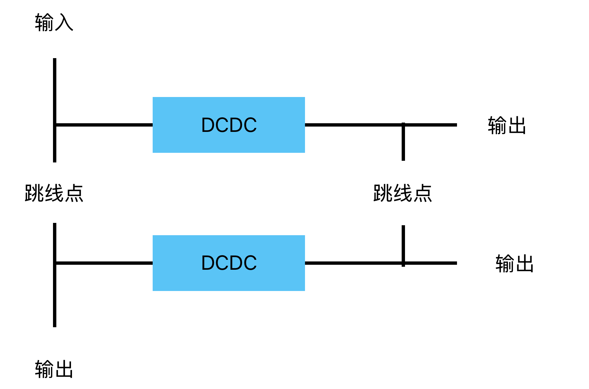

# RM2024桂电数控超级电容方案开源

设计者：杨宇翔

文档撰写：杨宇翔 钟启源 刘宇轩

桂林电子科技大学Evolution战队

## 前言

在RoboMaster机甲大师赛事中，严苛的底盘功率限制规则迫使各参赛队伍从软件和硬件方面研究高效的功率管理方案。而我队早在2018年末便研究并开源了较具有特色的超级电容方案，但2020年，官方裁判系统超级电容管理模块与相关限制规则加入，超级电容的使用更加规范，这也给我们带来了不小的挑战。

在这个赛季，我们结合本校学长的超级电容方案，经过近一赛季的研究与测试，开发出了采用4MOS结构的两相交错Buck-Boost电路构建的超级电容方案，希望能为超电的开发研究提供一个新的思路。

## 简介

本方案中的两相交错Buck-Boost变换器是一种采用载波移相180°的控制方式的电路结构。该变换器在Buck模式和Boost模式之间切换时，能够实现能量的双向流动，并且不会产生过压与过流现象。同时，交错并联的拓扑结构可以减少电感电流的纹波，降低每相电感的体积，并提高电路的响应速度，使其极其适用于超级电容的控制中。双向BuckBoost应用已经非常普遍，对于双向BuckBoost的原理在此不再赘述。

## 拓扑介绍

### 两相交错场景

#### 优劣分析

1.低纹波。上面提及，每一相电路其实是以100Khz的频率工作的，但相比于单相输出，两相交错180度可以将电流纹波进行互补输出，理论上总输出端纹波相互抵消，电压输出波形更加平稳。由于纹波消除作用，它的有效输入与输出纹波变为 200KHz。因此在计算交错式设计的电感时，适用的频率虽和单相设计完全相同，但能允许的纹波电流却会增加一倍，使得设计所需的电感值得以减少一半，电容设计也是如此，等效后电压纹波的明显降低，使得设计所需的输出电容数量减少，节约成本的同时，也大大缩小了整个模块的体积，整个电源环路设计更加简洁。

2.高效率。两相交错升降压电源虽然是每相将两个周期合并降频至100Khz工作，但实际总输出特性仍可等效为200Khz的工作场景。与单相相比，我们将开关管的开关频率降低，减小了开关管的开关损耗，从而进一步降低了整个电源的静态功耗，提升了整个模块的功率密度。而在负载场景下，由于每相分走一半电流，两相更好控制了电感的温度升幅，提升了模块的效率，值得一提的是，在两相交错下，电路的响应基本等同于单路电路的响应，没有受到频率降低的影响。

#### 控制方法

在低功率场景时，本方案采用两相Buck-Boost的控制方法。假设我们此时处于50%占空比时的Buck模式：在第一个周期中，第一路左边半桥的两个开关管Q1,Q2正常进行50%占空比的PWM开关，右边半桥上管Q3处于常通状态；第二路左右半桥两上管Q5,Q7处于关闭状态，两下管处于常通状态。在第二个周期中，将两路电源的开关管状态进行交换。（如图所示）

不难看出，两路电源每隔一个周期工作一次，并且是处于交错工作的状态。如果我们将开关频率调整至200Khz,那么此时可以把每一路电源等效为在以100Khz的频率进行开关，两相交错180度。由于我们的方案是并联两相输出，因此总输出端是互补输出的，实际整个电路的开关频率还是处于200Khz的状态。

本超电方案的最大的劣势在于控制板上并没有太多的电容供储能使用，但电容组的存在令这一劣势的影响微乎其微，多出的空间反而使整块板的布局变得更加合理美观，功能也更加齐全，为其的使用锦上添花。

### 并联输出场景

#### 电压源并联可行性分析

 一般情况下，由于受控电压源的电压随着控制量的变化而变化，其产生的电压值不是固定不变的，根据电路理论，两个理想受控电压源中电压高的会给电压低的充电，使其电流过高，造成损坏，因此无法直接并联。

但是在实际情况下，电压源内阻以及导线电阻并非小到不能忽略。当两不同电压源同时为一个用电器供电时，根据基尔霍夫电流原理，流入等于流出，并带入数值加以计算，可以得出两电压源电压值为正数，只要保证两电压源的输出电流大于0即可保证两电压源都在向用电器输入能量。因此在实际应用中，受控电压源的并联都是采用电压源加理想二极管构成不间断电源方案，进而实现并联。然而对于双向电源来说，二极管限制了电流方向，此方案不可行。本超电方案中通过在交错状态下分时导通和并联状态下恒比例输出实现均流控制，减少环路损耗。

#### 优劣分析
对于导通损耗，损耗功率和电流的平方成正比，并联两相可以减少MOS管流过的峰值电流，减少损耗，提高效率。同时在并联状态下，电感量减半，同时带来两倍的电流斜率，此时响应也优于交错。实际控制中，采用低功率下交错，高功率和负载迁越时并联的方式，在保证最优性能的情况下最大限度降低损耗。

#### 控制方法

在高功率和负载迁越场景时，两路同步并联输出，本方案采用并联Buck-Boost的控制方法。两个并联的电压源使用。在使用时，若将右上管常导通，右下管常断开，而左上和左下管继续使用Buck电路控制策略，则完全等效于Buck电路的拓扑，此时可将电路看作同步Buck，可实现将左侧电降压后提供给右侧；若将左上常导通，左下常断开，而右上和右下继续使用Boost电路控制策略，则完全等效于Boost电路的拓扑，此时将电路看作同步Boost即可实现将左侧电升压后提供给右侧；若左右电压相近，则in半管的占空比会减少，out半管的占空比会增加，两者逐渐趋同，此时实际应用中由于最大占空比以及死区时间等限制，很难独立的使用Buck或者Boost拓扑。于是考虑用Buck控制策略控制左半桥，用Boost控制策略控制右半桥，此即为buck-boost电路。在任意时刻，电路可视为Buck电路或Boost电路。此时，无论是使用叠加原理还是通过伏秒平衡定律，我们都可以得到如下结果 Vleft/Vright=Dright/Dleft ，其中， Dleft 为左侧上管占空比， Dright 为右侧上管占空比。

## 效率提升

在高负载下，超电控制模块的温度会会显著提升。一般的应对方法是利用一些降温手段，如采用铝基板、添加散热片、甚至是加装散热风扇来保证持续高负载下模块的性能。而我们更倾向于从源头解决问题——提高模块的效率，即通过一些硬件设计和软件控制的方式，降低电能转化成的热能，从而减少电能的流失，最终达成提高效率的目的。这从一方面来看，能高效地将底盘电能搬运储存，或是将超电中储存的电能最大程度输送回底盘供电，提升机器人的性能；另一方面，减少模块的发热，也就能控制模块的故障发生率，保证机器人在运行中用电的稳定性和安全性。

那么，如何提高模块的效率？首先我们要考虑的是实际使用过程中哪里会让其产生损耗，这样才能对症下药。例如，电流在回路传输过程中，导线和采样电阻都会发热；四开关管频繁的开关过程中也会产生不小的损耗；电感、电容参数计算不准确会产生更多的损耗······

接着，我们就要考虑如何尽最大可能地减少这些损耗。从分析模块的电流环路，优化PCB布局，减小电流环流面积等方面下手是个不错的选择，当然，器件的摆放也很关键，良好的布局才能保证超电拥有优异性能的同时又能有良好的散热性。下图为持续负载30A 1小时下的温度图像，分散的两个环路使得散热效率大幅提升，同时优化的电流环路在最小环路面积下使得电路损耗降低。

效率提升最重要在于考虑元器件所造成的损耗。在实际使用过程中，电感和开关管的发热是比较明显的，故从这二者下手。改善电感效率的重心在于参数的计算和电感的选型，我们采用的是饱和电流30A的一体成型电感，在实际测试中，两路共30A时电感温度稳定在60摄氏度左右。MOS管的损耗主要为开关损耗和导通损耗：导通损耗是MOS管在工作状态时Rds(on)产生的，公式为

P=Io²×Rds(on)

而开关损耗的产生则是因为MOS管虽然是电源型器件，但是由于极间结电容的存在，MOS管漏源极导通需要栅极驱动电流充电后才能正常打开，关闭时亦是如此，公式为

P=Qg×Vg×fsw×2

开关管所产生的损耗可以通过硬件选型和软件控制这两种方式来降低。首先是MOS管的选型，从公式不难看出产生的损耗主要是由Rds(on)和Qg这两个参数决定的，在选型时应仔细斟酌其内部材料的使用，比较得出性能更加突出的选型。当然，由于栅极上升沿时间的存在，MOS管若不能及时打开或关闭，也会造成更多的损耗，且如果续流管没有及时打开，只能通过自身的体二极管续流，此时产生的损耗是极其严重的。解决该问题的办法一般是更换Qg更小的MOS管或者增加驱动电流，我们选用的栅极驱动是LM5109，该芯片能提供持续1A的驱动电流，实测使用此芯片模块上MOS管栅极上升沿约为50纳秒，同比其他芯片更为迅速。同时，我们采用自举的方式为半桥供电，因此由于自举电容充电时间和栅极驱动时间的限制，模块不能到达100%占空比。软件降低损耗主要采用上面介绍的交错两相控制的方法，这样不仅能让两路均流，使得单路导通损耗减少，MOS管发热减小，而且将200Khz的开关频率降低一半，也能使开关损耗降低，并且将模块输出的最高占空比提高至100%。

## 多拓扑结构 

模块预留了两个大电流跳线点，通过改变跳线点的连接状态，可将结构改为双通道独立输入输出，单通道交流输出，升降压稳压型UPS（输出稳压型超电，如30v供电轮系）如下图所示，为备赛电赛提供更多选择。对于这些拓扑结构都已进行验证，这部分的代码之后将示完成度开源。

## 输入输出参数

### 额定最大值

输入电压8-30V，电容端单通道瞬态30A，持续负载10A。双通道瞬态60A（电容组60A恒流输出持续到没电），持续负载20A.（无散热片和风冷）

电容端输出2-30V，底盘输出端12-30V（单通道升压版可到40V）

### 输出波纹值

可以对输入，输出，电容组处电压进行测量，监测控制模块的实际输出电压。

确保输出电压在设定范围800mV内，静态波纹70mv, 10W-400W迁越负载电压波动1200mV，1A-20A ,2500mA/us负载斜率下恢复时间1ms。具备多端电流测量，监测功率控制模块的实际输出电流。确认输出电流与设定值相符，辅助功率控制，并在需要时进行调整。

## 保护机制

超电烧毁乃兵家常事，为保证超电正常稳定运行，项目成立之初就提出要完善其自身的保护机制，延长其使用寿命。（超电控制板成本在200元左右，也是为了减少此项支出）

硬件件具备输入输出TVS、输入欠压保护机制。

软件具备过载、电容组过压、输入欠压、电容组欠压、模组元器件损坏的保护机制，并可在模块无永久性损坏风险的情况下自行恢复。

确认保护触发后，系统能够在1ms内停机或采取其他适当的措施。

触发自锁保护后，仅能在模块状态正常后通过断电重启解除保护，系统严重损坏后保护可能失效。

自锁保护状态：输入欠压保护，电容端过压保护，输出端过压保护（刹车时产生过高电动势，超级电容无法完全吸收），过流保护，MOS损坏保护

得益于交错模式的超快响应和极强的过流能力，虽然设有如上保护，但其从未在赛场上触发，从联盟赛上场至今，超电在赛场上保持着0失误的记录。

## 上位机

为方便功能的维护和升级，还配套制作了上位机程序。由于控制逻辑过于复杂，为保证逐周期环路计算，代码不得不做许多优化，包括但不限于大量内敛，导致代码逻辑十分混乱，且没有注释，代码部分待优化完成后开源，如需尝鲜的兄弟可以通过上位机下载代码。

因代码中没有使用输出电流检测，故大部分板子没有焊电流感应放大器，该功能正常可用。

## 结语

祝愿大家超电永远不烧！！！

未经许可禁止商用！！！

联系方式

# 测试报告

## Output Ripple

### 测试图

4A负载下输出纹波

8A负载下输出纹波

12A负载下输出纹波

16A负载下输出纹波

20A负载下输出纹波

### 测试分析

注：以下测试分析将引用KEYSIGHT旗下的电源E36150的电源参数进行比较分析。

根据波形可以看出，随着负载增大，输出端纹波有明显增加。这是由于模块设计时受PCB尺寸限制，输出电容未使用更大容值的固态电容，导致模块在工作过程中输出端电容充放电电荷量改变，引起电容电压波动量增加，进而提高了输出的纹波率。在输出电流16A负载下，模块的输出纹波为71mV，在额定输出电流20A负载下，模块的输出纹波为162mV，计算可得纹波率为1.08%，在RM的应用场景中，此纹波率已满足系统的正常运行。在额定电压、电流输出下，E36150最大输出纹波小于75mV，在与产品级的电源输出纹波比较下，此模块还是存在较大的差距。

## Transient

### 测试图

Ilow=1A Ihigh=12A Slew rate=2.5A/us F=100Hz

负载拉低：振铃峰峰值1V，恢复时间0.8ms；负载拉高：振铃峰峰值1.2V,恢复时间1.6ms。

测试结果可知，模块在负载拉低状态下的动态响应明显优于负载拉高状态下的动态响应。负载拉高时，产生振铃的峰峰值高，会出现一小段过冲反馈欠阻尼现象，且恢复时间较长，系统发生震荡后收敛周期更长。负载拉低时，恢复时间相较短，且无明显过冲现象，在产生振铃后波形迅速收敛。E36150电源的动态响应不超过1ms，这点与我们模块较为相近，但是E36150的Voltage Settling Band为150mV，且反馈阻尼效果好，不会发生过冲现象，并且系统不会发生持续震荡，这点我们模块是比较欠佳的。双通道的环路控制逐周期计算，要求算力过大，目前使用PI双环，未能使用最高电流斜率，优化此环路计算可获得更高动态响应。

## Load Regulation

### 测试图

### 测试分析

测试结果可知模块在不同的稳定负载下，输出电压示数趋于稳定，无明显波动，且输出电压处于设定5%区间内，满足正常工作要求。E36150电源的负载调整率为0.01%±2mV，我们模块在额定电流60%以下时负载调整率可达到此参数，但是超过该区间后，负载调整率表现稍逊。

## MOS Vds Spike

### 测试图

### 测试分析

测试了模块频繁开关的MOS管Vds波形，均如上述测试图所示，开关时无过冲现象。且波形稳定，无二次开启、误关断等不良现象。

## Efficiency

### 测试图

### 测试分析

模块的静态功耗约为2.7W，在低负载下，模块效率达到93%，而在负载施加至额定电流的60%以上后，效率稳定达到96.5%以上。参考车载标准80plus能效标准，10%负载90%效率，20%负载92%效率，50%负载94%效率，100%负载90%效率。在此标准下，我们模块在额定功率的每个负载段效率都表现良好。

### Rise Time & OverShoot

### 测试图

### 测试分析

模块上电输出端波形正常，无过冲现象。且做到输出端启动软开关，保护后级负载不受启动时电压应力和冲击电流影响。电压上升时间约3ms，既满足缓启动要求，也不会因为上升时间过长影响后级电路的正常启动工作。

## Line Regulation

### 测试图

### 测试分析

测试结果表明，模块在空载和负载10A的测试环境下，输入电压发生改变时，输出电压恒定值均处于设定输出电压的5%区间之中，模块线性调整率正常。E36150电源的线性调整率为0.01%±2mV，我们模块在与最大输入电压压差10V以上的时候，线性调整率数据达不到此标准。
